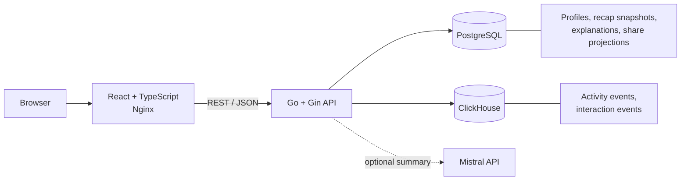

# Avito Recap City

Персональные «Итоги года» для пользователей Авито в формате интерактивного города. Активность пользователя превращается в связную историю: метрики, главный район, роль, стиль, достижения, объяснения и безопасную карточку для публикации.

## Проблема

За год пользователь совершает множество разрозненных действий: смотрит объявления, добавляет их в избранное, публикует предложения, общается и завершает сделки. Сырые счётчики плохо передают ценность этой активности, а прямой показ подробных действий может нарушать приватность.

Проект решает две задачи:

- помогает пользователю увидеть свой год как понятную и эмоциональную историю;
- создаёт для Авито дополнительную точку возврата, досмотра и безопасного шеринга.

## Идея решения

Мы представляем Авито как город пользователя:

- вертикаль продукта становится районом;
- категория становится улицей;
- интенсивность активности влияет на визуальную застройку;
- роль, стиль и достижения объясняют поведение пользователя за год.

Бизнес-факты, архетип и достижения вычисляются детерминированными правилами. Mistral используется только для короткой суммаризации поверх заранее разрешённых фактов. При отсутствии ключа или ошибке внешнего API backend автоматически возвращает воспроизводимый template fallback.

## Что реализовано в MVP

- выбор одного из тестовых профилей;
- генерация recap для пары `profile_id + year`;
- повторный запрос возвращает сохранённый immutable snapshot;
- интерактивный изометрический город на Canvas;
- карточки с активными днями, ключевой метрикой, главным районом, ролью и стилем;
- персональные достижения с уровнями;
- отдельный endpoint с объяснением решений;
- безопасная публичная share-проекция;
- обработка недостаточной активности и технических ошибок;
- запись продуктовых interaction events;
- template fallback при недоступном Mistral;
- unit-тесты, линтеры и GitHub Actions CI;
- запуск всего стека одной командой через Docker Compose.

## Архитектура



### Поток генерации

1. Frontend получает список профилей через `GET /api/v1/profiles`.
2. Пользователь выбирает год и запускает `POST /api/v1/recaps`.
3. Backend читает события профиля за год из ClickHouse.
4. Аналитический модуль считает метрики, географию и hash активности.
5. Правила персонализации выбирают роль, стиль и достижения.
6. Narrative-модуль формирует summary через Mistral или template fallback.
7. Готовый recap, explanations и share projection сохраняются в PostgreSQL.
8. Frontend адаптирует API DTO к view model и показывает последовательность карточек.

## Технологии

| Область | Технологии |
|---|---|
| Frontend | React 19, TypeScript 6, Vite 8, React Router, Canvas API |
| Backend | Go 1.23, Gin, `database/sql`, HTTP client |
| Хранилища | PostgreSQL 15, ClickHouse 24.8 |
| AI | Mistral Chat Completions API, JSON Schema, deterministic fallback |
| Контракты | OpenAPI 3.0.3 |
| Инфраструктура | Docker, Docker Compose, Nginx |
| Quality | Go tests, `go vet`, `gofmt`, Node test runner, ESLint, Prettier, GitHub Actions |

## Быстрый запуск

### Требования

- Docker Engine;
- Docker Compose v2.

### Запуск всего приложения

```bash
git clone https://github.com/inxrius/avito-hackathon.git
cd avito-hackathon

docker compose up -d --build
```

После запуска:

- frontend: http://localhost:5173
- backend API: http://localhost:8080/api/v1

Проверка состояния:

```bash
docker compose ps
curl http://localhost:8080/api/v1/profiles
```

Остановка:

```bash
docker compose down
```

Полный сброс локальных данных и повторное применение seed-миграций:

```bash
docker compose down -v
docker compose up -d --build
```

## Mistral API key

В репозитории **нет Mistral API key**. По умолчанию `MISTRAL_API_KEY` пустой, поэтому проект полностью работает с `template`-суммаризацией. Для проверки основного сценария ключ не требуется.

Чтобы локально включить Mistral и не коммитить секрет, создайте файл `.env` в корне репозитория:

```env
MISTRAL_API_KEY=<your-key>
```

И локальный `docker-compose.override.yml`:

```yaml
services:
  backend:
    environment:
      MISTRAL_API_KEY: ${MISTRAL_API_KEY}
```

Оба файла исключены из Git. После этого запустите:

```bash
docker compose up -d --build --force-recreate backend frontend
```

В ответе нового recap поле `generation.narrative.source` будет равно `mistral`. Для уже сохранённого snapshot источник не меняется; для чистой проверки можно выполнить `docker compose down -v`.

## API

Канонический контракт находится в [`docs/openapi.yaml`](docs/openapi.yaml).

| Метод | Endpoint | Назначение |
|---|---|---|
| `GET` | `/api/v1/profiles` | Список профилей и доступных годов |
| `GET` | `/api/v1/profiles/{id}` | Получение профиля |
| `POST` | `/api/v1/recaps` | Создание или получение существующего recap |
| `GET` | `/api/v1/recaps/{id}` | Получение сохранённого recap |
| `GET` | `/api/v1/recaps/{id}/explanation` | Объяснение роли, стиля и достижений |
| `GET` | `/api/v1/recaps/{id}/share` | Безопасная публичная проекция |
| `POST` | `/api/v1/recaps/{id}/interactions` | Запись продуктового события |

Пример генерации:

```bash
curl -X POST http://localhost:8080/api/v1/recaps \
  -H 'Content-Type: application/json' \
  -d '{
    "profile_id": "11111111-1111-1111-1111-111111111111",
    "year": 2026
  }'
```

Первый успешный запрос возвращает `201 Created`, повторный запрос для той же пары профиля и года - `200 OK` с тем же snapshot.

## Структура проекта

```text
.
├── .github/workflows/       # GitHub Actions CI
├── backend/
│   ├── cmd/server/          # HTTP server entrypoint
│   ├── internal/
│   │   ├── config/          # environment configuration
│   │   ├── handler/         # Gin HTTP handlers
│   │   ├── model/           # API models
│   │   ├── recap/           # analytics, rules, narrative, assembly, pipeline
│   │   ├── repository/      # PostgreSQL and ClickHouse adapters
│   │   └── service/         # application orchestration
│   ├── migrations/          # PostgreSQL and ClickHouse schema/seed
│   ├── pkg/database/        # database clients
│   └── Dockerfile
├── frontend/
│   ├── src/
│   │   ├── app/             # router and application shell
│   │   ├── pages/           # profiles, generation, recap, public share
│   │   ├── entities/city/   # deterministic Canvas city renderer
│   │   ├── widgets/         # share card UI
│   │   └── shared/          # API adapter, types, palette, utilities
│   ├── nginx.conf           # SPA serving and `/api` proxy
│   └── Dockerfile
├── docs/                    # OpenAPI, DB model, task and Git workflow
├── context/                 # compact architectural/product context
└── docker-compose.yml       # full-stack local environment
```

## Особенности реализации

### Воспроизводимость

Одинаковые события, год и версия алгоритма дают одинаковые метрики, роль, стиль и достижения. Snapshot содержит версию алгоритма и hash активности, а город получает детерминированный seed.

### Разделение хранилищ

- PostgreSQL - source of truth для профилей и готовых recap snapshots;
- ClickHouse - событийное хранилище активности и продуктовой аналитики.

### Объяснимость

Роль, стиль и достижения выбираются правилами, а причины доступны через отдельную explanation-проекцию. AI не выбирает факты, архетипы или достижения.

### Безопасная AI-суммаризация

Mistral получает только allowlisted safe facts. Ответ проверяется по JSON Schema, ограничению длины, разрешённым числам и отсутствию URL. Любая ошибка приводит к deterministic template fallback и не ломает recap.

### Приватность

Публичная share-card формируется отдельно от личного recap и содержит только разрешённые поля. Подробные объяснения и внутренние метрики не попадают в публичную проекцию.

### Frontend adapter

Backend остаётся источником истины для бизнес-данных. Frontend API adapter преобразует DTO в presentation model, не пересчитывая метрики и правила персонализации.

## Тесты и CI

Локальные проверки:

```bash
cd backend
gofmt -w ./cmd ./internal ./pkg
go vet ./...
go test ./...

cd ../frontend
npm ci
npm run check
```

`npm run check` последовательно запускает frontend tests, ESLint и production build.

GitHub Actions выполняет:

- проверку форматирования Go;
- `go vet` и backend tests;
- frontend tests, lint и build;
- валидацию Docker Compose и сборку application images.

## Ограничения MVP и дальнейшее развитие

Текущая версия синхронно генерирует recap и визуально акцентирует главный район пользователя. Следующий приоритетный шаг - отдавать из backend безопасное распределение активности по нескольким вертикалям и одновременно показывать несколько полноценных районов в CityCanvas.

В дальнейшей версии также рассматриваются:

- асинхронная генерация со статусами и SSE/polling;
- broker/outbox/inbox для burst-нагрузки и повторной доставки;
- отдельный Analytics Service и typed gRPC contract;
- ClickHouse materialized views для массовой предгенерации;
- воспроизводимые нагрузочные и fault-тесты.

Эти компоненты планируется добавлять только после benchmark: инфраструктура должна подтверждать пользу на измеримой нагрузке, а не усложнять продукт ради демонстрации.

## Команда и распределение ответственности

| Участник | GitHub | Основной вклад |
|---|---|---|
| Александр Цыков | `At0-m` | Продуктовая и техническая архитектура, OpenAPI, recap domain и analytics, правила персонализации, narrative/Mistral, сборка pipeline, интеграция backend с PostgreSQL/ClickHouse, стабилизация E2E, финальная frontend-полировка, тесты, CI и Docker Compose |
| Станислав Шегай | `inxrius` | Инициализация репозитория, backend models, repository/service/HTTP layers, годовая фильтрация активности, интеграция generator pipeline|
| Дмитрий | `DemiusHTTV` | Frontend и пользовательский сценарий, интерактивный Canvas-город, страницы и компоненты recap, адаптация frontend к реальному backend contract|
| Роман Карелин | `mamooin` | Восстановление и структурирование требований, ранние архитектурные решения, документация OpenAPI и модели базы данных |

Зоны ответственности пересекались: архитектурные решения, интеграция контрактов, тестирование и финальная стабилизация выполнялись совместно через review и pull requests.

## История разработки

Разработка велась в персональных feature/fix-ветках с pull requests в интеграционную ветку `dev`. Основные этапы:

1. фиксация требований, OpenAPI и модели данных;
2. реализация recap analytics, personalization и narrative pipeline;
3. создание repository/service/HTTP слоёв и подключение PostgreSQL/ClickHouse;
4. frontend с детерминированным Canvas-городом;
5. согласование frontend/backend contract и полный E2E flow;
6. стабилизация Mistral fallback, interactions, share/explanation;
7. тесты, CI и Docker Compose для воспроизводимого запуска.

Подробная хронология ключевых коммитов и вклад участников вынесены в [`docs/commit-history.md`](docs/commit-history.md).

Полную техническую историю можно посмотреть непосредственно в Git:

```bash
git log --oneline --graph --decorate --all
```

## Документация

- [`docs/openapi.yaml`](docs/openapi.yaml) - публичный API-контракт;
- [`docs/database-models.md`](docs/database-models.md) - модель хранения;
- [`docs/git-workflow.md`](docs/git-workflow.md) - процесс веток и PR;
- [`docs/task.md`](docs/task.md) - структурированная постановка и Definition of Done;
- [`context/PROJECT_CONTEXT.md`](context/PROJECT_CONTEXT.md) - компактный контекст проекта.